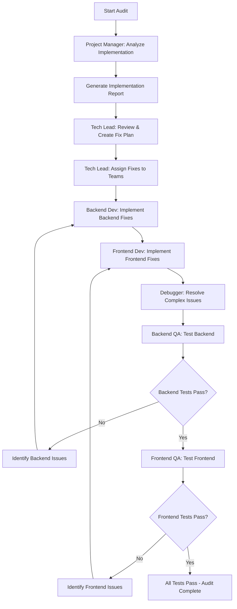

# Audit Implementation Command - Continuous Fix Until Success

This command performs a comprehensive audit of the project implementation and automatically fixes all issues found until everything works correctly. No new tasks are created - all problems are resolved in the current execution.

## Command Overview

The audit implementation command orchestrates multiple specialized agents to:
1. Analyze the current implementation against planned architecture
2. Identify any deviations or issues
3. Automatically fix all problems found
4. Test until everything passes
5. Continue looping until complete success

## Workflow Diagram



## Execution Steps

### Phase 1: Project Manager Analysis
The project-manager agent performs comprehensive analysis:

```
Launch project-manager agent with:
- Read Git history using gh commands:
- Analyze PLANNING.md for:
  - Domain-Driven Design architecture
  - Technology stack decisions
  - Implementation phases
  - Success metrics
- Review TASK.md for:
  - Completed tasks and their implementation details
  - Current sprint status
  - Any discovered issues or technical debt
- Generate comprehensive implementation report including:
  - Executive summary of project state
  - Alignment with DDD bounded contexts
  - Technology stack compliance
  - Task completion analysis
  - Identified gaps or deviations
```

### Phase 2: Tech Lead Review and Fix Planning
The tech-lead agent reviews findings and creates action plan:

```
Launch tech-lead agent with:
- Review project-manager's implementation report
- Analyze codebase architecture:
  - Check domain boundaries and bounded contexts
  - Verify repository patterns and service layers
  - Validate API design and contracts
  - Review frontend/backend integration
- Create comprehensive fix plan:
  - Categorize issues by domain/context
  - Prioritize based on impact and dependencies
  - Design technical solutions for each issue
  - Create specific assignments for dev teams
```

### Phase 3: Development Team Fix Implementation
Multiple agents work in parallel to implement fixes:

```
Backend Development:
- Launch backend-dev agent with tech-lead's backend assignments
- Implement fixes for:
  - Domain model corrections
  - API endpoint updates
  - Service layer improvements
  - Database schema adjustments
  - Authentication/authorization fixes

Frontend Development:
- Launch frontend-dev agent with tech-lead's frontend assignments
- Implement fixes for:
  - Component architecture alignment
  - State management corrections
  - API integration updates
  - UI/UX improvements
  - Routing and navigation fixes

Complex Issue Resolution:
- Launch debugger agent for any blocking issues
- Debug and resolve:
  - Performance bottlenecks
  - Integration failures
  - Test failures
  - Build/deployment issues
```

### Phase 4: Quality Assurance Testing Loop
Comprehensive testing until all issues resolved:

```
Backend Testing:
- Launch backend-qa agent to:
  - Test all API endpoints
  - Validate business logic
  - Check database operations
  - Verify authentication flows
  - Test integration points
- If failures found:
  - Document specific issues
  - Return to backend-dev for fixes
  - Loop until all backend tests pass

Frontend Testing:
- Launch frontend-qa agent to:
  - Test all user workflows
  - Validate UI components
  - Check responsive design
  - Test cross-browser compatibility
  - Verify accessibility
- If failures found:
  - Document specific issues
  - Return to frontend-dev for fixes
  - Loop until all frontend tests pass
```

### Phase 5: Final Validation
Once all individual tests pass:

```
Comprehensive Integration Testing:
- Test end-to-end workflows across all user roles
- Validate cross-domain integrations
- Performance testing under load
- Security validation
- Final architectural compliance check
```

## Agent Orchestration

### Sequential Flow:
1. **project-manager** � Generates implementation report
2. **tech-lead** � Reviews report and creates fix assignments
3. **backend-dev** + **frontend-dev** � Work in parallel on fixes
4. **debugger** � Assists when complex issues arise
5. **backend-qa** + **frontend-qa** � Test implementations
6. Loop back to step 3 if issues found

### Communication Between Agents:
- Each agent passes detailed reports to the next
- Issues are documented with specific reproduction steps
- Fix verification includes regression testing
- All changes are tracked and documented

## Fix Loop Logic

```python
while not all_tests_passing:
    # Development Phase
    if backend_issues:
        backend_dev.implement_fixes(tech_lead.assignments)
        if complex_issues:
            debugger.assist_backend()
    
    if frontend_issues:
        frontend_dev.implement_fixes(tech_lead.assignments)
        if complex_issues:
            debugger.assist_frontend()
    
    # Testing Phase
    backend_results = backend_qa.run_tests()
    if not backend_results.passed:
        backend_issues = backend_results.failures
        continue
    
    frontend_results = frontend_qa.run_tests()
    if not frontend_results.passed:
        frontend_issues = frontend_results.failures
        continue
    
    # Both passed - exit loop
    all_tests_passing = True
```

## Completion Criteria

The audit is considered complete when:
1.  All backend tests pass (backend-qa confirmation)
2.  All frontend tests pass (frontend-qa confirmation)
3.  No architectural violations remain
4.  All user workflows function correctly
5.  Performance meets defined thresholds
6.  Security requirements satisfied

## Error Handling

### Unresolvable Issues:
If an issue cannot be fixed after multiple attempts:
1. Document the blocker with full context
2. Identify root cause and dependencies
3. Propose alternative solutions
4. Continue with other fixes if possible

### Critical Failures:
If critical infrastructure fails:
1. Stop execution immediately
2. Document the failure state
3. Provide recovery instructions
4. Save progress for resumption

## Usage

```
/audit-implementation
```

This will:
1. Start comprehensive implementation audit
2. Identify all deviations and issues
3. Automatically fix all problems found
4. Test continuously until everything works
5. Provide final success report

## Output

Upon completion, the command provides:
- Summary of all issues found and fixed
- Test results from all QA agents
- Performance metrics
- Architectural compliance report
- Any remaining concerns or recommendations

## Notes

- This is a fully automated process that continues until success
- No manual intervention required unless critical failures occur
- All fixes are implemented directly - no new tasks created
- Changes are committed incrementally for easy rollback if needed
- The process is idempotent - can be run multiple times safely