# 科研实验班课程管理系统 - 路由结构与工作流程图

## 目录
1. [系统架构概述](#系统架构概述)
2. [基于角色的路由结构](#基于角色的路由结构)
3. [课程模块路由设计](#课程模块路由设计)
4. [核心工作流程图](#核心工作流程图)
5. [跨角色交互工作流](#跨角色交互工作流)
6. [数据流与追踪设计](#数据流与追踪设计)
7. [移动端路由适配](#移动端路由适配)
8. [扩展性设计考虑](#扩展性设计考虑)

---

## 系统架构概述

### 核心设计原则
- **角色导向路由**：每个角色拥有独立的路由空间和权限控制
- **课程模块化**：支持实验室轮转课程、综合素质评价课程，并为未来课程类型预留扩展接口
- **过程数据追踪**：所有关键操作节点可追踪、可审计
- **中文优先界面**：所有路由、导航、提示信息使用中文

### 技术栈建议
```
Frontend Framework: React 18+ 或 Vue 3+
Router: React Router v6 或 Vue Router v4
状态管理: Redux Toolkit 或 Pinia
UI组件库: Ant Design 或 Element Plus
权限控制: RBAC (Role-Based Access Control)
数据持久化: Axios + JWT Token
```

---

## 基于角色的路由结构

### 主路由架构
```
/
├── /login                          # 登录页面
├── /dashboard                      # 角色选择/总览仪表板
├── /professor                      # 教授角色路由空间
├── /student                        # 学生角色路由空间
├── /secretary                      # 科研秘书角色路由空间
├── /leader                         # 领导角色路由空间
├── /shared                         # 共享功能路由
└── /system                         # 系统管理路由
```

### 教授角色路由 (/professor)
```
/professor
├── /dashboard                      # 教授工作台
├── /courses                        # 课程管理
│   ├── /create                     # 创建课程
│   ├── /manage                     # 管理我的课程
│   ├── /lab-rotation              # 实验室轮转课程
│   │   ├── /:courseId/overview    # 课程概览
│   │   ├── /:courseId/projects    # 项目发布
│   │   ├── /:courseId/students    # 学生管理
│   │   ├── /:courseId/tasks       # 任务分配
│   │   ├── /:courseId/meetings    # 周会管理
│   │   ├── /:courseId/reports     # 里程碑报告
│   │   └── /:courseId/grading     # 成绩评定
│   └── /comprehensive-eval        # 综合素质评价课程
│       ├── /:courseId/overview    # 评价概览
│       ├── /:courseId/standards   # 评价标准
│       ├── /:courseId/materials   # 材料审核
│       └── /:courseId/scoring     # 专家评分
├── /students                       # 学生管理
│   ├── /selection                 # 学生选拔
│   ├── /interviews                # 面试管理
│   ├── /assignments               # 作业管理
│   └── /evaluation                # 学生评估
├── /tasks                          # 任务管理
│   ├── /pending                   # 待处理任务
│   ├── /completed                 # 已完成任务
│   └── /reminders                 # 任务提醒
├── /resources                      # 资源管理
│   ├── /materials                 # 教学材料
│   ├── /references               # 参考文献
│   └── /qa                        # 在线答疑
└── /profile                        # 个人设置
```

### 学生角色路由 (/student)
```
/student
├── /dashboard                      # 学生工作台
├── /courses                        # 课程相关
│   ├── /available                 # 可选课程
│   ├── /enrolled                  # 已选课程
│   ├── /lab-rotation              # 实验室轮转课程
│   │   ├── /:courseId/overview    # 课程信息
│   │   ├── /:courseId/application # 志愿填报
│   │   ├── /:courseId/tasks       # 任务列表
│   │   ├── /:courseId/submissions # 作业提交
│   │   ├── /:courseId/meetings    # 会议记录
│   │   ├── /:courseId/reports     # 报告提交
│   │   └── /:courseId/results     # 成果展示
│   └── /comprehensive-eval        # 综合素质评价课程
│       ├── /:courseId/info        # 评价信息
│       ├── /:courseId/materials   # 材料提交
│       ├── /:courseId/progress    # 评价进度
│       └── /:courseId/results     # 评价结果
├── /assignments                    # 作业管理
│   ├── /pending                   # 待完成作业
│   ├── /submitted                 # 已提交作业
│   └── /graded                    # 已批改作业
├── /communication                  # 师生交流
│   ├── /qa                        # 问答交流
│   ├── /appointments              # 预约面试
│   └── /feedback                  # 反馈建议
├── /attendance                     # 考勤管理
│   ├── /checkin                   # 签到打卡
│   ├── /leave                     # 请假申请
│   └── /records                   # 考勤记录
└── /profile                        # 个人中心
    ├── /info                      # 个人信息
    ├── /grades                    # 成绩查询
    └── /achievements              # 成果展示
```

### 科研秘书角色路由 (/secretary)
```
/secretary
├── /dashboard                      # 秘书工作台
├── /course-management             # 课程管理
│   ├── /metadata                  # 课程元数据
│   ├── /permissions               # 权限分配
│   ├── /lab-rotation              # 实验室轮转管理
│   │   ├── /setup                 # 课程设置
│   │   ├── /resources             # 资源汇总
│   │   ├── /matching              # 双选匹配
│   │   ├── /monitoring            # 过程监控
│   │   └── /assessment            # 成果评估
│   └── /comprehensive-eval        # 综合素质评价管理
│       ├── /scheme                # 评价方案
│       ├── /expert-panel          # 专家组管理
│       ├── /collection            # 信息采集
│       ├── /review                # 材料审核
│       └── /calculation           # 成绩核算
├── /data-management               # 数据管理
│   ├── /collection                # 数据收集
│   ├── /statistics                # 数据统计
│   ├── /reports                   # 报告生成
│   ├── /reminders                 # 催收任务
│   └── /export                    # 数据导出
├── /monitoring                     # 监控预警
│   ├── /progress                  # 进度监控
│   ├── /conflicts                 # 矛盾预警
│   ├── /ai-assistance             # AI辅助分析
│   └── /intervention              # 干预措施
├── /activities                     # 活动管理
│   ├── /events                    # 活动发布
│   ├── /registration              # 报名管理
│   ├── /attendance                # 签到管理
│   └── /summary                   # 活动总结
├── /leader-support                # 领导支持
│   ├── /reports-prep              # 报告准备
│   ├── /data-summary              # 数据汇总
│   └── /recommendations           # 建议方案
└── /system-admin                  # 系统管理
    ├── /users                     # 用户管理
    ├── /permissions               # 权限配置
    ├── /logs                      # 操作日志
    └── /backup                    # 数据备份
```

### 领导角色路由 (/leader)
```
/leader
├── /dashboard                      # 领导仪表板
├── /curriculum-design             # 课程体系设计
│   ├── /planning                  # 体系规划
│   ├── /standards                 # 评估标准
│   ├── /approval                  # 方案审批
│   └── /ai-assistance             # AI辅助设计
├── /data-overview                 # 数据总览
│   ├── /statistics                # 统计数据
│   ├── /analytics                 # 数据分析
│   ├── /trends                    # 趋势分析
│   └── /comparisons               # 对比分析
├── /reports                       # 报告管理
│   ├── /annual                    # 年度报告
│   ├── /periodic                  # 定期报告
│   ├── /ai-generated              # AI生成报告
│   └── /custom                    # 自定义报告
├── /decision-support              # 决策支持
│   ├── /recommendations           # 改进建议
│   ├── /predictions               # 预测分析
│   ├── /scenarios                 # 场景分析
│   └── /impact-assessment         # 影响评估
└── /governance                    # 治理管控
    ├── /policies                  # 政策制定
    ├── /oversight                 # 监督管理
    ├── /approvals                 # 审批流程
    └── /quality-assurance         # 质量保障
```

### 共享功能路由 (/shared)
```
/shared
├── /notifications                  # 通知中心
│   ├── /inbox                     # 收件箱
│   ├── /sent                      # 已发送
│   ├── /drafts                    # 草稿箱
│   └── /settings                  # 通知设置
├── /calendar                       # 日程管理
│   ├── /view                      # 日程查看
│   ├── /create                    # 创建日程
│   └── /sync                      # 同步设置
├── /documents                      # 文档中心
│   ├── /library                   # 文档库
│   ├── /templates                 # 模板中心
│   ├── /shared-files              # 共享文件
│   └── /version-control           # 版本控制
├── /help                          # 帮助中心
│   ├── /guides                    # 使用指南
│   ├── /faq                       # 常见问题
│   ├── /tutorials                 # 教程视频
│   └── /contact                   # 联系支持
└── /feedback                      # 反馈中心
    ├── /suggestions               # 建议反馈
    ├── /bug-reports               # 问题报告
    └── /feature-requests          # 功能需求
```

---

## 课程模块路由设计

### 实验室轮转课程 - 基于角色的路由架构

#### 教授视图路由
```
/professor/courses/lab-rotation/:courseId
├── /overview                      # 课程概览
├── /topic-management              # 课题管理
│   ├── /publish                   # 发布课题
│   ├── /edit                      # 编辑课题
│   └── /resources                 # 上传资料
├── /student-selection             # 学生选拔
│   ├── /applications              # 查看申请
│   ├── /interviews                # 面试安排
│   ├── /selection                 # 选择学生
│   └── /confirmation              # 确认名单
├── /process-management            # 过程管理
│   ├── /task-assignment           # 任务分配
│   ├── /weekly-meetings           # 周会管理
│   ├── /milestone-review          # 里程碑审核
│   └── /qa-interaction            # 答疑互动
├── /assessment                    # 成果评估
│   ├── /homework-review           # 作业批改
│   ├── /report-evaluation         # 报告评审
│   ├── /defense-scoring           # 答辩评分
│   └── /final-grading             # 最终评分
└── /analytics                     # 数据分析
    ├── /student-progress          # 学生进度
    └── /course-statistics         # 课程统计
```

#### 学生视图路由
```
/student/courses/lab-rotation/:courseId
├── /home                          # 课程主页
├── /topic-browsing                # 课题浏览
│   ├── /list                      # 课题列表
│   ├── /details/:topicId          # 课题详情
│   └── /professor-info            # 导师信息
├── /application                   # 申请管理
│   ├── /apply                     # 提交申请
│   ├── /volunteer-preference      # 志愿填报
│   ├── /status                    # 申请状态
│   └── /interview-booking         # 面试预约
├── /learning-process              # 学习过程
│   ├── /tasks                     # 任务列表
│   ├── /submissions               # 作业提交
│   ├── /meetings                  # 会议记录
│   └── /progress                  # 进度跟踪
├── /achievements                  # 成果提交
│   ├── /poster-upload             # 海报上传
│   ├── /report-submission         # 报告提交
│   ├── /defense-preparation       # 答辩准备
│   └── /materials                 # 学习材料
└── /results                       # 成绩查询
    ├── /grades                    # 成绩详情
    ├── /feedback                  # 导师反馈
    └── /certificate               # 证书下载
```

#### 科研秘书视图路由
```
/secretary/courses/lab-rotation/:courseId
├── /dashboard                     # 管理仪表板
├── /course-setup                  # 课程配置
│   ├── /basic-info                # 基本信息
│   ├── /timeline                  # 时间设置
│   ├── /rules                     # 规则配置
│   └── /resources                 # 资源管理
├── /participant-management        # 参与者管理
│   ├── /professor-list            # 导师列表
│   ├── /student-list              # 学生列表
│   ├── /matching-overview         # 匹配概览
│   └── /adjustment                # 调剂管理
├── /process-monitoring            # 过程监控
│   ├── /task-completion           # 任务完成度
│   ├── /submission-tracking       # 提交跟踪
│   ├── /attendance                # 出勤统计
│   └── /alerts                    # 异常预警
├── /data-collection               # 数据收集
│   ├── /automated-sync            # 自动同步
│   ├── /manual-entry              # 手动录入
│   ├── /export                    # 数据导出
│   └── /reports                   # 报告生成
└── /coordination                  # 协调管理
    ├── /announcements             # 通知发布
    ├── /venue-booking             # 场地预订
    ├── /schedule-management       # 日程管理
    └── /issue-handling            # 问题处理
```

#### 领导视图路由
```
/leader/courses/lab-rotation/:courseId
├── /executive-overview            # 执行概览
│   ├── /key-metrics               # 关键指标
│   ├── /progress-summary          # 进度总结
│   └── /alerts                    # 重要提醒
├── /resource-analysis             # 资源分析
│   ├── /professor-workload        # 导师负荷
│   ├── /lab-utilization           # 实验室使用
│   ├── /budget-execution          # 经费执行
│   └── /optimization              # 优化建议
├── /quality-assessment            # 质量评估
│   ├── /student-outcomes          # 学生成果
│   ├── /satisfaction-survey       # 满意度调查
│   ├── /goal-achievement          # 目标达成
│   └── /comparative-analysis      # 对比分析
└── /strategic-decisions           # 战略决策
    ├── /policy-review             # 政策审查
    ├── /improvement-plans         # 改进计划
    └── /future-planning           # 未来规划
```

### 综合素质评价课程 - 基于角色的路由架构

#### 教授视图路由（专家组成员）
```
/professor/courses/comprehensive-eval/:courseId
├── /expert-dashboard              # 专家工作台
├── /review-tasks                  # 评审任务
│   ├── /assigned-students         # 分配的学生
│   ├── /pending-reviews           # 待评审列表
│   └── /completed-reviews         # 已完成评审
├── /evaluation-interface          # 评价界面
│   ├── /student/:studentId        # 学生评价
│   │   ├── /materials             # 查看材料
│   │   ├── /scoring               # 评分录入
│   │   └── /comments              # 评语撰写
│   └── /batch-review              # 批量评审
├── /standards-reference           # 标准参考
│   ├── /criteria                  # 评价标准
│   ├── /rubrics                   # 评分细则
│   └── /examples                  # 评分示例
└── /review-analytics              # 评审分析
    ├── /personal-stats            # 个人评审统计
    └── /consistency-check         # 一致性检查
```

#### 学生视图路由
```
/student/courses/comprehensive-eval/:courseId
├── /evaluation-home               # 评价主页
├── /notification-center           # 通知中心
│   ├── /announcements             # 评价公告
│   ├── /timeline                  # 时间安排
│   └── /requirements              # 评价要求
├── /material-submission           # 材料提交
│   ├── /forms                     # 填报表单
│   ├── /upload-center             # 上传中心
│   │   ├── /certificates          # 证书上传
│   │   ├── /projects              # 项目材料
│   │   └── /achievements          # 成果证明
│   ├── /preview                   # 预览确认
│   └── /submission-status         # 提交状态
├── /progress-tracking             # 进度跟踪
│   ├── /current-stage             # 当前阶段
│   ├── /completion-status         # 完成情况
│   └── /next-steps                # 下一步骤
└── /results-query                 # 结果查询
    ├── /final-results             # 最终结果
    ├── /score-breakdown           # 分数明细
    ├── /ranking                   # 排名信息
    └── /appeals                   # 申诉入口
```

#### 科研秘书视图路由
```
/secretary/courses/comprehensive-eval/:courseId
├── /evaluation-management         # 评价管理
├── /scheme-configuration          # 方案配置
│   ├── /basic-settings            # 基本设置
│   ├── /timeline-setup            # 时间配置
│   ├── /criteria-management       # 标准管理
│   └── /weight-configuration      # 权重设置
├── /expert-coordination           # 专家协调
│   ├── /panel-formation           # 组建专家组
│   ├── /task-assignment           # 任务分配
│   ├── /workload-balance          # 工作量平衡
│   └── /expert-communication      # 专家沟通
├── /collection-monitoring         # 收集监控
│   ├── /submission-progress       # 提交进度
│   ├── /material-review           # 材料初审
│   ├── /missing-items             # 缺失项目
│   └── /reminder-system           # 催收系统
├── /process-management            # 流程管理
│   ├── /stage-control             # 阶段控制
│   ├── /data-verification         # 数据核验
│   ├── /calculation-oversight     # 计算监督
│   └── /result-preparation        # 结果准备
└── /publication-handling          # 公示处理
    ├── /result-formatting         # 结果格式化
    ├── /publication-control       # 公示控制
    ├── /appeal-management         # 申诉管理
    └── /final-archiving           # 最终归档
```

#### 领导视图路由
```
/leader/courses/comprehensive-eval/:courseId
├── /evaluation-overview           # 评价总览
│   ├── /progress-dashboard        # 进度仪表板
│   ├── /participation-stats       # 参与统计
│   └── /key-indicators            # 关键指标
├── /fairness-monitoring           # 公平性监控
│   ├── /score-distribution        # 分数分布
│   ├── /deviation-analysis        # 偏差分析
│   ├── /expert-consistency        # 专家一致性
│   └── /anomaly-detection         # 异常检测
├── /outcome-analysis              # 成果分析
│   ├── /student-profiles          # 学生画像
│   ├── /grade-comparison          # 年级对比
│   ├── /trend-analysis            # 趋势分析
│   └── /weakness-identification   # 薄弱识别
└── /policy-evaluation             # 政策评估
    ├── /effectiveness-review      # 有效性审查
    ├── /goal-alignment            # 目标契合度
    ├── /improvement-suggestions   # 改进建议
    └── /decision-support          # 决策支持
```

---

## 核心工作流程图

### 1. 用户认证与权限控制流程


### 2. 实验室轮转课程完整生命周期流程


### 3. 综合素质评价课程工作流程


### 4. 任务提醒与催收机制流程


---

## 跨角色交互工作流

### 1. 师生互动工作流


### 2. 权限分配与管理工作流


### 3. 数据收集与统计工作流


---

## 数据流与追踪设计

### 1. 数据实体关系图


### 2. 数据追踪节点设计

| 追踪节点 | 数据类型 | 记录内容 | 触发条件 |
|---------|----------|----------|----------|
| 用户登录 | 认证日志 | 登录时间、IP地址、设备信息 | 每次登录 |
| 权限变更 | 权限日志 | 权限类型、变更前后状态、操作人 | 权限分配/回收 |
| 课程操作 | 业务日志 | 操作类型、课程ID、操作数据 | 课程CRUD操作 |
| 作业提交 | 学习日志 | 提交时间、文件信息、学生ID | 作业提交 |
| 成绩录入 | 评价日志 | 成绩数据、评分标准、教授ID | 成绩更新 |
| 消息通知 | 通信日志 | 消息内容、发送方、接收方 | 消息发送 |
| 系统异常 | 错误日志 | 异常类型、堆栈信息、用户操作 | 系统错误 |

### 3. 数据流向追踪图

```mermaid
graph LR
    subgraph "数据产生层"
        A1[用户操作]
        A2[系统事件]
        A3[外部集成]
    end
    
    subgraph "数据收集层"
        B1[操作日志]
        B2[业务数据]
        B3[系统监控]
    end
    
    subgraph "数据处理层"
        C1[实时处理]
        C2[批量处理]
        C3[数据清洗]
    end
    
    subgraph "数据存储层"
        D1[主数据库]
        D2[日志数据库]
        D3[分析数据库]
    end
    
    subgraph "数据应用层"
        E1[实时监控]
        E2[统计报告]
        E3[预警系统]
    end
    
    A1 --> B1
    A2 --> B2
    A3 --> B3
    B1 --> C1
    B2 --> C2
    B3 --> C3
    C1 --> D1
    C2 --> D2
    C3 --> D3
    D1 --> E1
    D2 --> E2
    D3 --> E3
```



---

## 扩展性设计考虑

### 1. 新课程类型扩展接口

```typescript
// 课程类型接口定义
interface CourseTypeInterface {
  courseTypeId: string;
  courseTypeName: string;
  routePrefix: string;
  phases: CoursePhase[];
  workflows: WorkflowDefinition[];
  permissions: PermissionMatrix;
  components: ComponentRegistry;
}

// 实验室轮转课程实现
class LabRotationCourse implements CourseTypeInterface {
  courseTypeId = 'lab-rotation';
  courseTypeName = '实验室轮转课程';
  routePrefix = '/courses/lab-rotation';
  
  phases = [
    { id: 'preparation', name: '前期筹备', routes: [...] },
    { id: 'matching', name: '双选匹配', routes: [...] },
    { id: 'execution', name: '过程管理', routes: [...] },
    { id: 'assessment', name: '成果验收', routes: [...] },
    { id: 'grading', name: '成绩评定', routes: [...] }
  ];
  
  workflows = [...];
  permissions = {...};
  components = {...};
}

// 课程类型注册器
class CourseTypeRegistry {
  private courseTypes: Map<string, CourseTypeInterface> = new Map();
  
  register(courseType: CourseTypeInterface) {
    this.courseTypes.set(courseType.courseTypeId, courseType);
    this.generateRoutes(courseType);
  }
  
  private generateRoutes(courseType: CourseTypeInterface) {
    // 动态生成路由配置
    // 动态注册组件
    // 动态配置权限
  }
}
```

### 2. 路由配置扩展模式

```javascript
// 动态路由配置工厂
class RouteConfigFactory {
  static generateCourseRoutes(courseType) {
    const baseRoute = `/courses/${courseType.routePrefix}/:courseId`;
    const routes = [];
    
    // 基础路由
    routes.push({
      path: baseRoute,
      component: () => import(`@/views/courses/${courseType.courseTypeId}/Layout.vue`),
      children: [
        {
          path: 'overview',
          component: () => import(`@/views/courses/${courseType.courseTypeId}/Overview.vue`)
        }
      ]
    });
    
    // 阶段路由
    courseType.phases.forEach(phase => {
      routes[0].children.push({
        path: phase.id,
        component: () => import(`@/views/courses/${courseType.courseTypeId}/${phase.component}.vue`),
        meta: { 
          phase: phase.id,
          permissions: phase.permissions 
        }
      });
    });
    
    return routes;
  }
}
```

### 3. 工作流扩展框架

```typescript
// 工作流定义接口
interface WorkflowDefinition {
  workflowId: string;
  name: string;
  description: string;
  steps: WorkflowStep[];
  triggers: WorkflowTrigger[];
  conditions: WorkflowCondition[];
}

interface WorkflowStep {
  stepId: string;
  name: string;
  type: 'manual' | 'automatic' | 'approval';
  roles: string[];
  actions: WorkflowAction[];
  nextSteps: string[];
}

// 工作流引擎
class WorkflowEngine {
  private workflows: Map<string, WorkflowDefinition> = new Map();
  
  registerWorkflow(workflow: WorkflowDefinition) {
    this.workflows.set(workflow.workflowId, workflow);
  }
  
  executeWorkflow(workflowId: string, context: any) {
    const workflow = this.workflows.get(workflowId);
    return this.processWorkflow(workflow, context);
  }
  
  private async processWorkflow(workflow: WorkflowDefinition, context: any) {
    // 工作流执行逻辑
    // 状态跟踪
    // 事件通知
    // 错误处理
  }
}
```

### 4. 未来扩展预留

```javascript
// 预留扩展点
const extensionPoints = {
  // 新角色扩展
  roles: {
    register: (roleDefinition) => { /* 注册新角色 */ },
    permissions: (roleId, permissions) => { /* 配置角色权限 */ }
  },
  
  // 新课程类型扩展
  courseTypes: {
    register: (courseTypeDefinition) => { /* 注册新课程类型 */ },
    customize: (courseTypeId, customization) => { /* 自定义课程行为 */ }
  },
  
  // 新工作流扩展
  workflows: {
    define: (workflowDefinition) => { /* 定义新工作流 */ },
    customize: (workflowId, customization) => { /* 自定义工作流 */ }
  },
  
  // 新组件扩展
  components: {
    register: (componentDefinition) => { /* 注册新组件 */ },
    override: (componentId, newComponent) => { /* 覆盖现有组件 */ }
  },
  
  // API扩展
  apis: {
    extend: (endpoint, handler) => { /* 扩展API端点 */ },
    middleware: (middleware) => { /* 添加中间件 */ }
  }
};
```

---

## 实施建议

### 1. 开发阶段规划

| 阶段 | 功能范围 | 预估时间 | 关键产出 |
|------|----------|----------|----------|
| 第一阶段 | 基础架构、用户认证、权限系统 | 4周 | 基础路由框架、权限控制 |
| 第二阶段 | 实验室轮转课程模块 | 6周 | 完整课程生命周期 |
| 第三阶段 | 综合素质评价模块 | 4周 | 评价流程实现 |
| 第四阶段 | 数据统计、报告生成 | 3周 | 数据分析功能 |
| 第五阶段 | 移动端适配、性能优化 | 3周 | 移动端应用 |
| 第六阶段 | 扩展接口、测试部署 | 2周 | 生产环境部署 |

### 2. 技术实施要点

- **路由懒加载**：使用动态import实现按需加载，提升首屏性能
- **权限路由守卫**：在每个路由级别实施细粒度权限控制
- **状态管理**：使用Vuex/Redux管理全局状态，路由状态持久化
- **API设计**：RESTful API设计，支持GraphQL查询优化
- **缓存策略**：路由级别缓存，数据预加载，离线支持
- **错误处理**：全局错误捕获，用户友好的错误提示
- **性能监控**：路由性能监控，用户行为分析

### 3. 质量保障措施

- **代码审查**：所有路由和工作流代码必须经过审查
- **自动化测试**：单元测试、集成测试、E2E测试覆盖
- **性能测试**：路由切换性能、并发用户测试
- **安全测试**：权限绕过测试、SQL注入防护测试
- **用户测试**：各角色用户的可用性测试
- **兼容性测试**：多浏览器、多设备兼容性测试

---

*本文档为华中科技大学机械科学与工程学院科研实验班课程管理系统的路由结构与工作流程设计文档。文档将随着项目推进持续更新和完善。*

*最后更新时间：2025年8月*